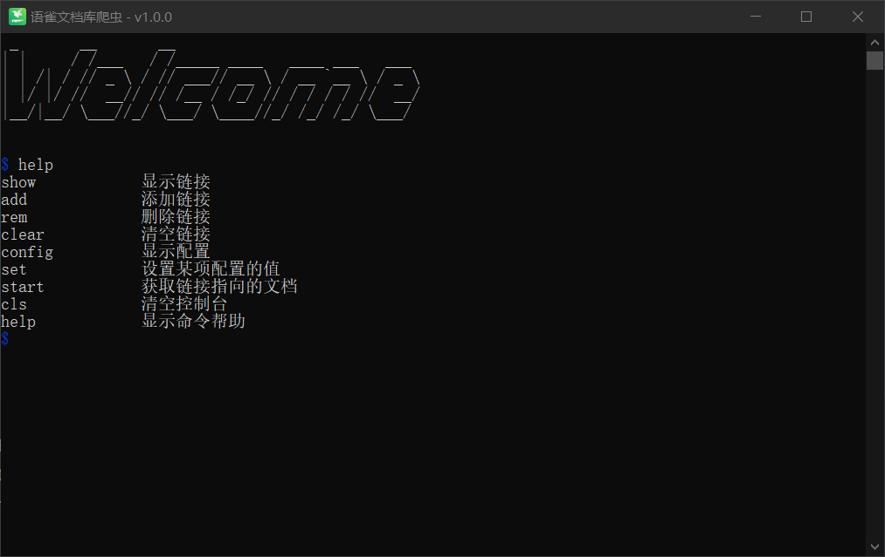

# 语雀文档库爬虫

一个命令行工具，用于获取语雀文档库中的文档或者单篇文档，非常的 `Strong`！



## 开发搭建

1. 确保您的系统已安装 Python 3.7 或更高版本。

2. 克隆此仓库到本地：

```bash
git clone https://github.com/gupingan/yuque-doc-spider.git
cd yuque-doc-spider
```

3. 安装依赖：

```bash
pip install -r requirements.txt
```

4. 运行程序

```bash
python main.py
```

## 快速入门

1. 设置 Cookie，如果文档库需要密码的，网页上访问后，请使用访问后的 Cookie

```bash
set Cookie <你的 Cookie>
```

2. 添加文档库或者文档的链接（自动识别单篇还是整个文档库）

```bash
add <link 1> <link 2> ...
```

3. 查看是否添加成功（显示所有的链接）

```bash
show
```

4. 开始获取文档并转存

```bash
start
```

5. 查看当前项目/程序所在目录下生成的 output 文件夹。

## 注意事项

- 使用 `config` 命令查看和设置配置项，确保在开始爬取之前正确设置了必要的参数（如Cookie等）。
- 使用 `add` 命令添加要爬取的语雀文档链接，支持1条或者多条。
- 使用 `start` 命令开始获取文档并转存为指定格式（默认 markdown）。
- 如果遇到任何问题，可以使用 `help <operate>` 命令获取更详细的使用说明。
